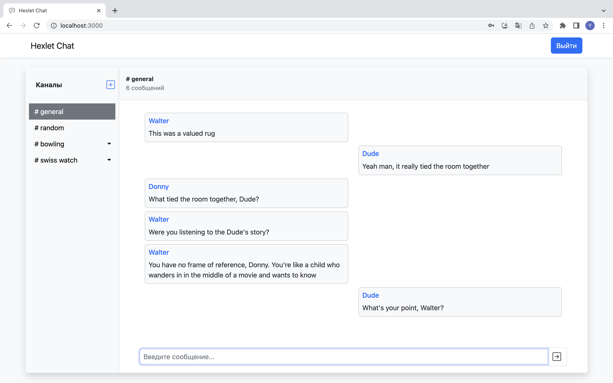
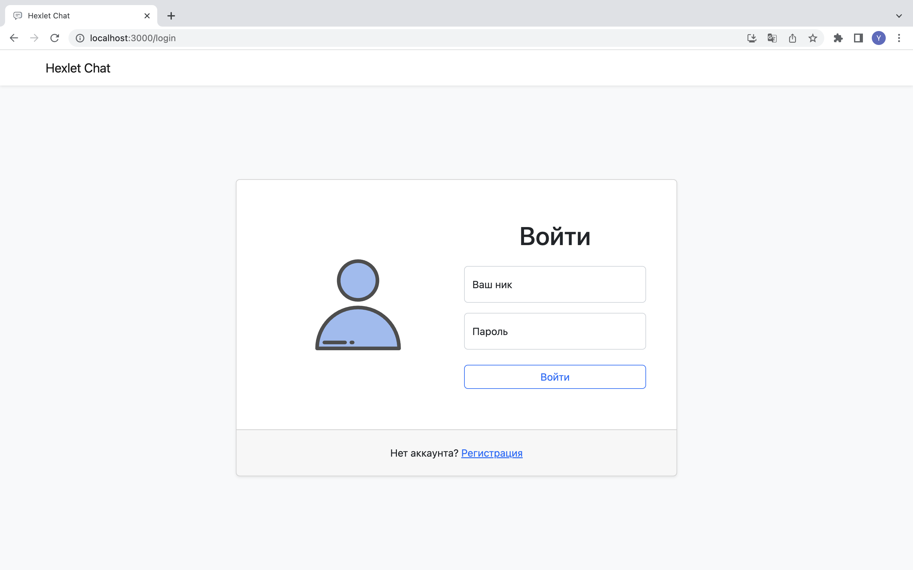
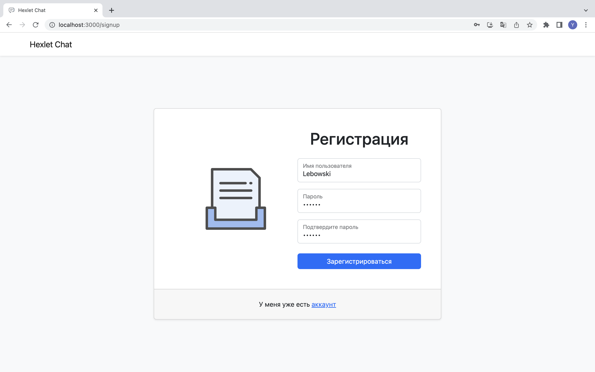
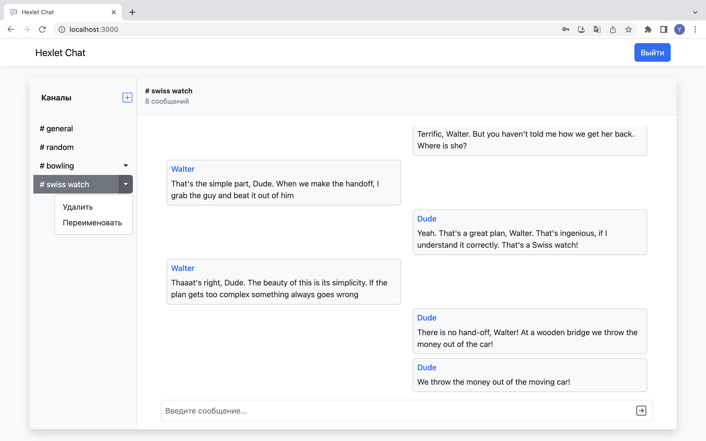
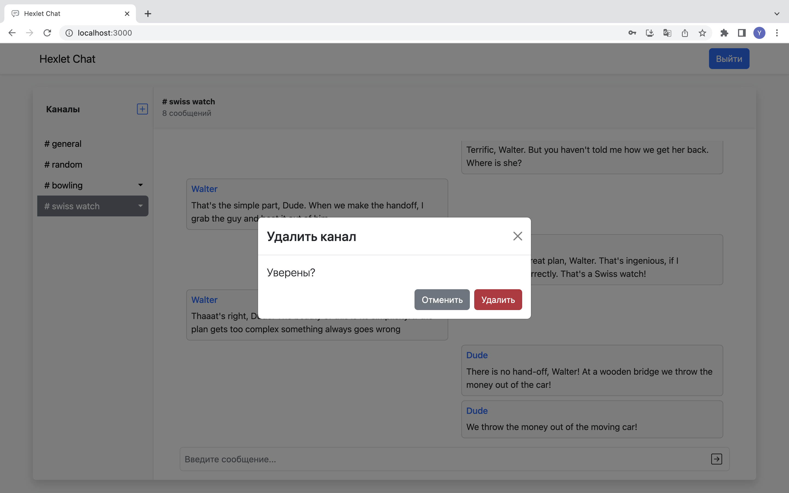
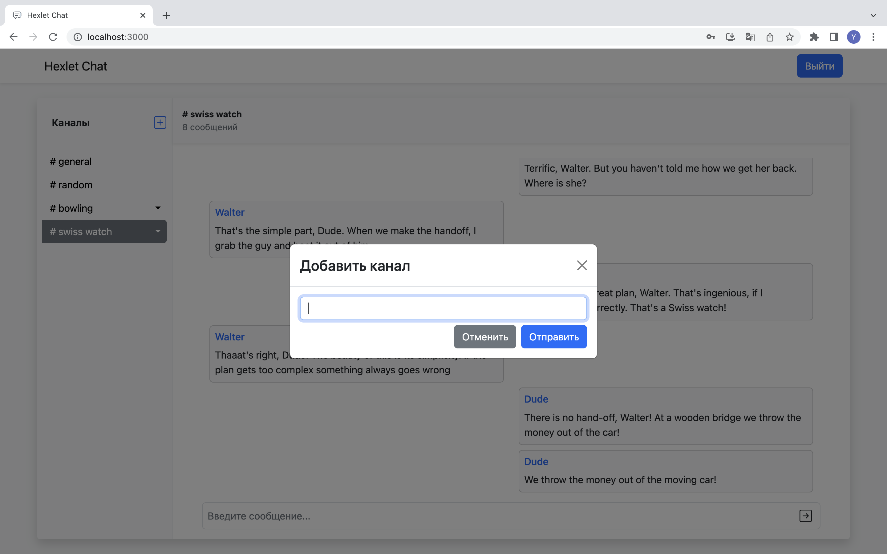

[](https://github.com/yurynefedov/frontend-project-12/actions)

# Chat App

A real-time application designed for message exchange using React with hooks and Redux (via reduxjs/toolkit) and includes features such as WebSocket integration, interaction with a REST API, client-side routing, and authentication. To simplify the styling process, the project use the react-bootstrap library.

Users can register within the application and communicate in group chats. By default, the application includes two channels, namely "general" and "random," which cannot be deleted or renamed. In addition to these default channels, users can create their own, change their names or delete them.

### Link

https://yurynefedov-chat-app.up.railway.app

### Demonstration

##### Chat Page

 </img>

 ##### Login

  </img>

 ##### Sign up

  </img>

##### Interactions with channels

</img>

</img>

</img>

</img>


### Setup

To deploy the project locally, you'll need to follow these steps:

1. Clone this repository on your computer:
```
git clone git@github.com:yurynefedov/frontend-project-12.git 
```
Other options for cloning the project repository can be found by clicking on the green button labeled "Code" in the top right corner of this GitHub page.

2. Install the required dependencies by running the following command in the project directory:
```
make install
```
3. Start the local development server by running the following command in the project directory: 
```
make start
```
This will launch the application on your local machine.

4. Access the application in your web browser by visiting the appropriate URL or port where the server is running.